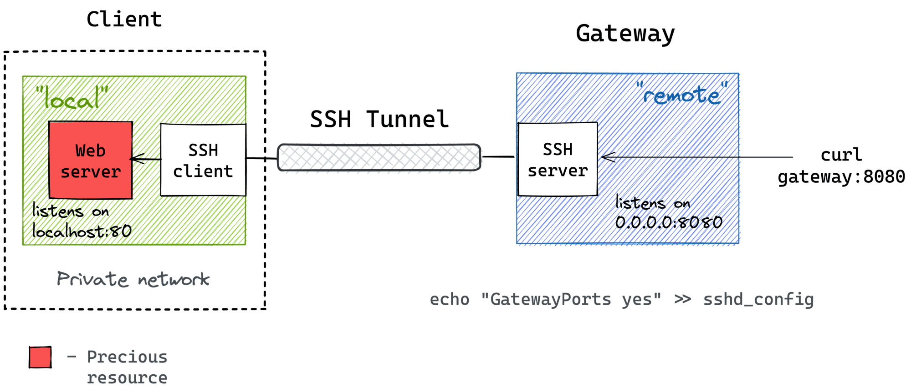

# Docker Reversed SSH Tunnel

Create a lightweight Alpine Linux based SSH tunnel to a host.  Uses pure SSH, no fluff.

**Image source & learn more about ssh tunneling [here](https://iximiuz.com/en/posts/ssh-tunnels/)**

FORKED FROM jujhars13/docker-ssh-tunnel but reversed the tunnel direction. 

## Perks

 - Stay up to date (with weekly builds that ensure that OpenSSH is up to date)

 - Lightweight

 - Easy to use

 - No need to install anything on the host or the client

## Required Parameters

| Variable           | Description                                                   | default    |
| ------------------ | ------------------------------------------------------------- | ---------- |
| `SSH_PORT`         | Port number for SSH                                           | 22         |
| `SSH_USER`         | Username for the SSH connection                               | root       |
| `LOCAL_IP`         | IP address of the target you want to expose                   | 127.0.0.1  |
| `LOCAL_PORT`       | The port you want to expose on the target                     | 80         |
| `GATEWAY_IP`       | IP/Domain of the machine that will expose your app (the host) | (required) |
| `REMOTE_PORT`      | Which port should sshd listen from on the gateway             | 80         |
| `REMOTE_IP`        | Which IP should sshd listen from on the gateway (`*` for all) | *          |

Note: Remember to inject/mount your private SSH key into the container to `/ssh_key/id_rsa`.

## Repos

- gcr.io: `docker pull gcr.io/kalitsune/docker-reversed-ssh-tunnel`
- Docker Hub: `docker pull kalithekitsune/docker-reversed-ssh-tunnel`

## Example

please refer to the [examples/docker-compose.yml](/examples/docker-compose.yaml) file for an example.

## Recommandations

if you want to use an open-ssh docker container as the gatewway, you can use this [linux-server.io image mod](https://github.com/linuxserver/docker-mods/tree/openssh-server-ssh-tunnel)